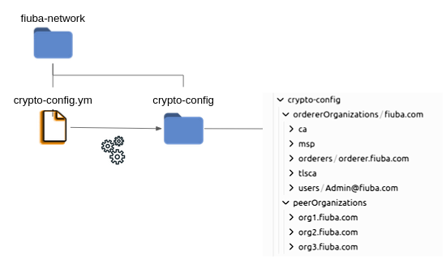
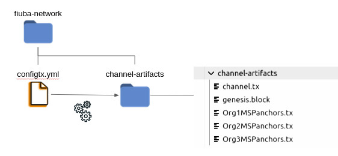
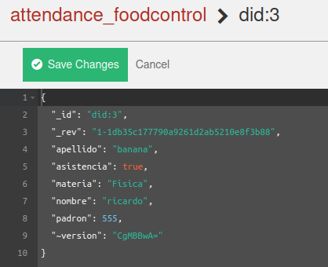

# BlockChain con Hyperledger Fabric (HyL-f)

### En colaboracion con el CETEC en marco de la Universidad de Buenos Aires de Ingenieria - Desarrollado en solución a la persistencia de datos en una red descentralizada para la toma de asistencia en instituciones educactivas.

## Arquitectura 

### Peers

Un peer, es un nodo donde se ejecuta logica del negocio, este puede tomar dos roles:
      
* committing Peer, mantiene el libro mayor y el estado, confima transacciones y puede contener contratos inteligentes(chaincode).

* Endorsing Peer, recibe una propuesta de transacción para respaldo, responde otorgando o denegando el respaldo. Debe tener contrato inteligente , verifica que su contenido obedezca a un contrato inteligente determinado, el endosante "firma" el contrato. 

### Orderer

Podemos ver al servicio de ordenamiento como un nodo que ejecuta logica propia de la arquitectura de HyL-f, como lo es ordenar las transacciones.
Es el responsable de mantener la integridad y el orden de las transacciones, y tambien es el encargado de asegurar la ejecución del protocolo de consenso, como:

* Solo(Testing). 
* Kafka-based(producción) es mas centralizada.
* RAFT(Producción) desde v1.4.2, cada organizacion puede ser parte del cluster y proponer nuevos participantes, lo que permite descentralizar mas la red. Aunque aun usa un sistema (lider-seguidor) donde el lider va cambiando entre los participantes de la red. 
Por lo tanto lo mas ideoneo en producción actualmente es, buenas politicas de endorsamiento en combinación con RAFT.

### Organizaciones

Llamamos organizaciones a los miembros y/o participantes que conforman la red y que conforman parte del consenso.

### Channel

Canal o channel, nos permite vincular un tipo determinado de transacciones en el libro mayor.
De esa manera podemos abstraer en el modelo de negocio el tipo de transacciones que se van a persistir en el libro mayor.
Y aislar el tipo de transacciones entre los participantes de la red.
Es decir que no todos los participantes tienen acceso a la misma información, solo los que pertenecen al mismo canal.

### CLI

Es un servicio que nos da hyperledger para comunicarnos con las organizaciones y consumir/administrar los smartcontract.
El cliente utiliza el SDK de Hyperledger fabric para enviar una transaccion a la red.

## Generamos configuraciones

### Creamos material criptografico
Conceptualmente representan las configuraciones que van a representar la identidad de nuestros participantes.

* Creamos el archivo crypto-config.yml

    > ### crypto-config.yml
    > Tipo: Configuración
    > Previsualización del archivo:
    >
    >     OrdererOrgs:
    >       - Name: Orderer
    >         Domain: fiuba.com
    >         EnableNodeOUs: true
    >         Specs:
    >           - Hostname: orderer
    >           SANS:
    >               - localhost
    >     PeerOrgs:
    >       - Name: Org1
    >         Domain: org1.fiuba.com
    >         EnableNodeOUs: true
    >         Template:
    >           Count: 1
    >           SANS:
    >           - localhost
    >         Users:
    >           Count: 1

    [ir a archivo crypto-config.yml](./fiuba-network/crypto-config.yml)

* Ejecutamos en la terminal el comando

    >     cryptogen generate --config=./crypto-config.yml

### Resultados

Se crea una carpeta crypto-config que incluye las configuraciones de las organizaciones que conforman la red, y la indentidad digital de sus participantes.

### Creamos configuraciones de bloque y transacciones.
Conceptualmente representa las configuraciones que van a determinar, comó se van a comunicar los participantes de la red.

* Creamos el archivo configtx.yml

    > ### configtx.yml
    > Tipo: Configuración
    > Previsualización del archivo:
    >
    >     ...
    >     Profiles:
    >       ThreeOrgsOrdererGenesis:
    >           <<: *ChannelDefaults
    >           Orderer:
    >               <<: *OrdererDefaults
    >               Organizations:
    >                   - *OrdererOrg
    >               Capabilities:
    >                   <<: *OrdererCapabilities
    >           Consortiums:
    >               SampleConsortium:
    >               Organizations:
    >                   - *Org1
    >                   - *Org2
    >                   - *Org3
    >       ThreeOrgsChannel:
    >           Consortium: SampleConsortium
    >           <<: *ChannelDefaults
    >           Application:
    >               <<: *ApplicationDefaults
    >               Organizations:
    >                   - *Org1
    >                   - *Org2
    >                   - *Org3
    >           Capabilities:
    >               <<: *ApplicationCapabilities

    [ir a archivo configtx.yml](./fiuba-network/configtx.yml)

* Ejecutamos los siguientes comandos

    >### Generamos el genesis.block
    >     configtxgen -profile ThreeOrgsOrdererGenesis -channelID system-channel -outputBlock ./channel-artifacts/genesis.block
    >### Generamos channel.tx 
    >     configtxgen -profile ThreeOrgsChannel -channelID attendance -outputCreateChannelTx ./channel-artifacts/channel.tx
    >### Generamos Org1MSPanchors.tx
    >     configtxgen -profile ThreeOrgsChannel -channelID attendance -outputAnchorPeersUpdate ./channel-artifacts/Org1MSPanchors.tx -asOrg Org1MSP
    >### Generamos Org2MSPanchors.tx
    >     configtxgen -profile ThreeOrgsChannel -channelID attendance -outputAnchorPeersUpdate ./channel-artifacts/Org2MSPanchors.tx -asOrg Org2MSP
    >### Generamos Org3MSPanchors.tx
    >     configtxgen -profile ThreeOrgsChannel -channelID attendance -outputAnchorPeersUpdate ./channel-artifacts/Org3MSPanchors.tx -asOrg Org3MSP

### Resultados

Verificamos que se haya creado los archivos en channel-artifacts.

## Levantamos la red

Con docker compose vamos a levantar la red que utiliza todas las configuraciones previamente creadas.

### Contenedor base de los peers
Creamos el directorio de trabajo /base.

* En el directorio /base creamos el archivo peer-base.yaml, que se se encarga de crear contenedor base para los peers de (HyL-f)

    > ### peer-base.yaml
    >
    > Tipo: Levantar Red
    >
    > Previsualización del archivo:
    >
    >     version: '2'
    >     services:
    >         peer-base:
    >             image: hyperledger/fabric-peer:2.2.0
    >             environment:
    >                 - CORE_VM_ENDPOINT=unix:///host/var/run/docker.sock
    >                 - CORE_VM_DOCKER_HOSTCONFIG_NETWORKMODE=fiuba-network_basic
    >                 - FABRIC_LOGGING_SPEC=INFO
    >                 - CORE_PEER_TLS_ENABLED=true
    >                 - CORE_PEER_GOSSIP_USELEADERELECTION=true
    >                 - CORE_PEER_GOSSIP_ORGLEADER=false
    >                 - CORE_PEER_PROFILE_ENABLED=true
    >                 - CORE_PEER_TLS_CERT_FILE=/etc/hyperledger/fabric/tls/server.crt
    >                 - CORE_PEER_TLS_KEY_FILE=/etc/hyperledger/fabric/tls/server.key
    >                 - CORE_PEER_TLS_ROOTCERT_FILE=/etc/hyperledger/fabric/tls/ca.crt
    >     working_dir: /opt/gopath/src/github.com/hyperledger/fabric/peer
    >     command: peer node start

    [ir a archivo peer-base.yaml](./fiuba-network/base/peer-base.yaml)

### Contenedores de los participantes y del servicio de ordenamiento

* Creamos el archivo docker-compose-base.yaml que se va a encargar de levantar los contenedores para los participantes y del servicio de ordenamiento.

    > ### docker-compose-base.yaml
    > 
    > Tipo : Levantar Red
    > 
    > Previsualización del archivo :
    > 
    >     services:
    >       orderer.fiuba.com:
    >           container_name: orderer.fiuba.com
    >           image: hyperledger/fabric-orderer:2.2.0
    >           environment:
    >               ...
    >           working_dir: /opt/gopath/src/github.com/hyperledger/fabric
    >           command: orderer
    >           volumes:
    >               ...
    >           ports:
    >               - 7050:7050
    >
    >       peer0.org1.fiuba.com:
    >           container_name: peer0.org1.fiuba.com
    >           extends:
    >               file: peer-base.yaml
    >               service: peer-base
    >           environment:
    >               ...
    >           volumes:
    >               ...
    >           ports:
    >               - 7051:7051
    >               - 7053:7053
    >
    >        peer0.org2.fiuba.com:
    >           ...

    [ir a archivo docker-compose-base.yml](./fiuba-network/base/docker-compose-base.yaml)

### Orquestamos los contenedores creados y ademas se agregan las bases de datos y servicios CA y CLI

* Creamos el archivo docker-compose-cli-couchdb.yaml que se va a encargar de orquestar todos los contenedores en una sola red y ademas agrega las bases de datos de cada participante y servicios como CA y CLI necesarios para la arquitectura (HyL-f).

    > ### docker-compose-cli-couchdb.yaml
    > 
    > Tipo : Levantar Red
    > 
    > Previsualización del archivo :
    > 
    >     networks:
    >       basic:
    >     services:
    >       orderer.fiuba.com:
    >           extends:
    >               file:   base/docker-compose-base.yaml
    >               service: orderer.fiuba.com
    >           container_name: orderer.fiuba.com
    >           networks:
    >               - basic
    >
    >       peer0.org1.fiuba.com:
    >           container_name: peer0.org1.fiuba.com
    >           extends:
    >               file:  base/docker-compose-base.yaml
    >               service: peer0.org1.fiuba.com
    >           environment:
    >               ...
    >           depends_on:
    >               - orderer.fiuba.com
    >               - couchdb0
    >           networks:
    >               - basic
    >
    >       peer0.org2.fiuba.com:
    >           ...
    >       
    >       peer0.org3.fiuba.com:
    >           ...
    >
    >       ca.org1.fiuba.com:
    >           image: hyperledger/fabric-ca:1.4.8
    >           environment:
    >               ...
    >           ports:
    >               - "7054:7054"
    >           command: sh -c 'fabric-ca-server start -b admin:adminpw'
    >           volumes:
    >               ...
    >           container_name: ca.org1.fiuba.com
    >           networks:
    >               - basic
    >       cli:
    >           container_name: cli
    >           image: hyperledger/fabric-tools:2.2
    >           tty: true
    >           stdin_open: true
    >           environment:
    >               ...
    >           working_dir: /opt/gopath/src/github.com/hyperledger/fabric/peer
    >           command: /bin/bash
    >           volumes:
    >               ...
    >           depends_on:
    >               - orderer.fiuba.com
    >               - peer0.org1.fiuba.com
    >               - peer0.org2.fiuba.com
    >               - peer0.org3.fiuba.com
    >           networks:
    >               - basic
    >   
    >           couchdb0:
    >               image: couchdb:3.1
    >           environment:
    >               ...
    >           ports: 
    >               - 5984:5984
    >           container_name: couchdb0
    >           networks:
    >               - basic
    >
    >           couchdb1:
    >               ...
    >
    >           couchdb2:
    >               ...

    [ir a archivo docker-compose-cli-couchdb.yaml](./fiuba-network/docker-compose-cli-couchdb.yaml)

### Levantamos todo

* Vamos a trabajar con un cliente para administrar los contenedores como portainer.
Para eso creamos primero un volumen

      docker volume create portainer_data
    
* Levantamos el contenedor

      docker run -d -p 8000:8000 -p 9000:9000 -v /var/run/docker.sock:/var/run/docker.sock -v portainer_data:/data portainer/portainer
    
* Nos conectamos al localhost:9000 y creamos una cuenta antes de los 3 minutos.

    

* Exportamos las variables de entorno que necesitamos.

      export CHANNEL_NAME=attendance
      export VERBOSE=false
      export FABRIC_CFG_PATH=$PWD
    
* Ahora sí, levantamos el docker compose.

      CHANNEL_NAME=$CHANNEL_NAME docker compose -f docker-compose-cli-couchdb.yaml up -d

* Verificamos si se levanto todo.
      
    

### Terminamos de configurar la red

* Creamos el canal "attendance". Nos conectamos a la consola de comando del contenedor CLI.

      -export CHANNEL_NAME=attendance
      -peer channel create -o orderer.fiuba.com:7050 -c $CHANNEL_NAME -f ./channel-artifacts/channel.tx --tls true --cafile /opt/gopath/src/github.com/hyperledger/fabric/peer/crypto/ordererOrganizations/fiuba.com/orderers/orderer.fiuba.com/msp/tlscacerts/tlsca.fiuba.com-cert.pem 

    Se nos tiene que crear el archivo attendance.block

* Añadimos la primer organizacion al canal que toma por defecto CLI.

      -peer channel join -b attendance.block

* Añadimos la segunda organización al canal

      -CORE_PEER_MSPCONFIGPATH=/opt/gopath/src/github.com/hyperledger/fabric/peer/crypto/peerOrganizations/org2.fiuba.com/users/Admin@org2.fiuba.com/msp CORE_PEER_ADDRESS=peer0.org2.fiuba.com:7051 CORE_PEER_LOCALMSPID="Org2MSP" CORE_PEER_TLS_ROOTCERT_FILE=/opt/gopath/src/github.com/hyperledger/fabric/peer/crypto/peerOrganizations/org2.fiuba.com/peers/peer0.org2.fiuba.com/tls/ca.crt peer channel join -b attendance.block

* Añadimos la tercer organización al canal.

      -CORE_PEER_MSPCONFIGPATH=/opt/gopath/src/github.com/hyperledger/fabric/peer/crypto/peerOrganizations/org3.fiuba.com/users/Admin@org3.fiuba.com/msp CORE_PEER_ADDRESS=peer0.org3.fiuba.com:7051 CORE_PEER_LOCALMSPID="Org3MSP" CORE_PEER_TLS_ROOTCERT_FILE=/opt/gopath/src/github.com/hyperledger/fabric/peer/crypto/peerOrganizations/org3.fiuba.com/peers/peer0.org3.fiuba.com/tls/ca.crt peer channel join -b attendance.block

### Terminamos de configurar a los participantes de la red

Tenemos que tener seteado en cada organizacion el anchorpeer correspondiente.

* Para la organización 1

      peer channel update -o orderer.fiuba.com:7050 -c $CHANNEL_NAME -f ./channel-artifacts/Org1MSPanchors.tx --tls --cafile /opt/gopath/src/github.com/hyperledger/fabric/peer/crypto/ordererOrganizations/fiuba.com/orderers/orderer.fiuba.com/msp/tlscacerts/tlsca.fiuba.com-cert.pem

* Para la organización 2

      CORE_PEER_MSPCONFIGPATH=/opt/gopath/src/github.com/hyperledger/fabric/peer/crypto/peerOrganizations/org2.fiuba.com/users/Admin@org2.fiuba.com/msp CORE_PEER_ADDRESS=peer0.org2.fiuba.com:7051 CORE_PEER_LOCALMSPID="Org2MSP" CORE_PEER_TLS_ROOTCERT_FILE=/opt/gopath/src/github.com/hyperledger/fabric/peer/crypto/peerOrganizations/org2.fiuba.com/peers/peer0.org2.fiuba.com/tls/ca.crt peer channel update -o orderer.fiuba.com:7050 -c $CHANNEL_NAME -f ./channel-artifacts/Org2MSPanchors.tx --tls --cafile /opt/gopath/src/github.com/hyperledger/fabric/peer/crypto/ordererOrganizations/fiuba.com/orderers/orderer.fiuba.com/msp/tlscacerts/tlsca.fiuba.com-cert.pem

* Para la organización 3

      CORE_PEER_MSPCONFIGPATH=/opt/gopath/src/github.com/hyperledger/fabric/peer/crypto/peerOrganizations/org3.fiuba.com/users/Admin@org3.fiuba.com/msp CORE_PEER_ADDRESS=peer0.org3.fiuba.com:7051 CORE_PEER_LOCALMSPID="Org3MSP" CORE_PEER_TLS_ROOTCERT_FILE=/opt/gopath/src/github.com/hyperledger/fabric/peer/crypto/peerOrganizations/org3.fiuba.com/peers/peer0.org3.fiuba.com/tls/ca.crt peer channel update -o orderer.fiuba.com:7050 -c $CHANNEL_NAME -f ./channel-artifacts/Org3MSPanchors.tx --tls --cafile /opt/gopath/src/github.com/hyperledger/fabric/peer/crypto/ordererOrganizations/fiuba.com/orderers/orderer.fiuba.com/msp/tlscacerts/tlsca.fiuba.com-cert.pem
      
### FELICIDADES!!! ACA SE TERMINA TODO LO DEVOPS PARA BLOCKCHAIN

## Agregamos los chaincode y/o smartsontract

Un chaincode es un bloque de codigo que tiene logica de persisitnencia y consulta de informacion en la blockchain.
Un smartcontract hace referencia a la logica del negocio, es decir que información queremos persisitir.
Un chaincode puede agrupar varios smartcontract.

### Creamos nuestro chaincode

En este caso vamos a usar Golang y se va a llamar foodcontrol, pero simplemente por que en el curso en que nos estamos basando, persisitían información de comida "Food" y todas la rutas de configuración utilizaron ese nombre.
Lo idea seria llamarlo alumnoControl y volver a generar todas las configuraciones con las rutas actualizadas.

* Creamos el archivo foodcontrol.go en el directorio /chaincode.

> ### Datos que se van a persisitir
>
>     type Alumno struct {
>	    Nombre string `json:"nombre"`
>	    Apellido string `json:"apellido"`
>	    Padron int `json:"padron"`
>	    Materia string `json:"materia"`
>	    Asistencia bool `json:"asistencia"`
>     }

> ### Metodos necesarios
>
>     func (s *SmartContract) Set(ctx contractapi.TransactionContextInterface,
>        alumnoId string,
>        nombre string,
>        apellido string,
>        padron int ,
>        materia string,
>        asistencia bool)
>      error
>     func (s *SmartContract) Query(ctx contractapi.TransactionContextInterface,
>       alumnoId string)
>     (*Alumno, error)

> ### Main
>
>     func main() {
>       chaincode, err := contractapi.NewChaincode(new(SmartContract))
>       if err != nil {
>   		fmt.Printf("Error create foodcontrol chaincode: %s", err.Error())
>   		return
>   	}
>   	if err := chaincode.Start(); err != nil {
>   		fmt.Printf("Error starting foodcontrol chaincode: %s", err.Error())
>   	}
>     }

[ver archivo foodcontrol.go](./chaincode/foodcontrol/foodcontrol.go)

### Agregamos nuestro chaincode a la red

Ahora nos conectamos al servicio de CLI ejecutamos las siguientes lineas.

* Configuramos las siguientes variables de entorno.

      export CHANNEL_NAME=attendance
      export CHAINCODE_NAME=foodcontrol
      export CHAINCODE_VERSION=1
      export CC_RUNTIME_LANGUAGE=golang
      export CC_SRC_PATH="../../../chaincode/$CHAINCODE_NAME"
      export ORDERER_CA=/opt/gopath/src/github.com/hyperledger/fabric/peer/crypto/ordererOrganizations/fiuba.com/orderers/orderer.fiuba.com/msp/tlscacerts/tlsca.fiuba.com-cert.pem

* Generamos el package del chaincode.

      peer lifecycle chaincode package ${CHAINCODE_NAME}.tar.gz --path ${CC_SRC_PATH} --lang ${CC_RUNTIME_LANGUAGE} --label ${CHAINCODE_NAME}_${CHAINCODE_VERSION} >&log.txt

* Instalamos el chaincode en la primer organización

      peer lifecycle chaincode install ${CHAINCODE_NAME}.tar.gz

    Nos tiene que retornar un identificador para el chaincode que vamos a usar para commitear.
    
      foodcontrol_1:d7dcb74d448855c2b545033b3c985f92c245642198f61283dadfa24c4204f32b

* Instalamos el chaincode en la segunda organización

      CORE_PEER_MSPCONFIGPATH=/opt/gopath/src/github.com/hyperledger/fabric/peer/crypto/peerOrganizations/org2.fiuba.com/users/Admin@org2.fiuba.com/msp CORE_PEER_ADDRESS=peer0.org2.fiuba.com:7051 CORE_PEER_LOCALMSPID="Org2MSP" CORE_PEER_TLS_ROOTCERT_FILE=/opt/gopath/src/github.com/hyperledger/fabric/peer/crypto/peerOrganizations/org2.fiuba.com/peers/peer0.org2.fiuba.com/tls/ca.crt peer lifecycle chaincode install ${CHAINCODE_NAME}.tar.gz

    Nos retorna el siguiente identificador
      
      foodcontrol_1:d7dcb74d448855c2b545033b3c985f92c245642198f61283dadfa24c4204f32b

* Instalamos el chaincode en la tercer organización

      CORE_PEER_MSPCONFIGPATH=/opt/gopath/src/github.com/hyperledger/fabric/peer/crypto/peerOrganizations/org3.fiuba.com/users/Admin@org3.fiuba.com/msp CORE_PEER_ADDRESS=peer0.org3.fiuba.com:7051 CORE_PEER_LOCALMSPID="Org3MSP" CORE_PEER_TLS_ROOTCERT_FILE=/opt/gopath/src/github.com/hyperledger/fabric/peer/crypto/peerOrganizations/org3.fiuba.com/peers/peer0.org3.fiuba.com/tls/ca.crt peer lifecycle chaincode install ${CHAINCODE_NAME}.tar.gz

    Nos retorna el siguiente identificador.

      foodcontrol_1:d7dcb74d448855c2b545033b3c985f92c245642198f61283dadfa24c4204f32b

    Observar que los identificadores deben ser los mismos.

* Definimos las politicas de aprobación para el chaincode, aca es donde decidimos que organizaciones tienen permisos para firmar transacciones.
En este caso solo las primera y tercera organizacion van a tener permisos de escritura.
   
   Para la primer organización.

      peer lifecycle chaincode approveformyorg --tls --cafile $ORDERER_CA --channelID $CHANNEL_NAME --name $CHAINCODE_NAME --version $CHAINCODE_VERSION --sequence 1 --waitForEvent --signature-policy "OR ('Org1MSP.peer','Org3MSP.peer')" --package-id foodcontrol_1:d7dcb74d448855c2b545033b3c985f92c245642198f61283dadfa24c4204f32b

   Para la tercer organización.

      CORE_PEER_MSPCONFIGPATH=/opt/gopath/src/github.com/hyperledger/fabric/peer/crypto/peerOrganizations/org3.fiuba.com/users/Admin@org3.fiuba.com/msp CORE_PEER_ADDRESS=peer0.org3.fiuba.com:7051 CORE_PEER_LOCALMSPID="Org3MSP" CORE_PEER_TLS_ROOTCERT_FILE=/opt/gopath/src/github.com/hyperledger/fabric/peer/crypto/peerOrganizations/org3.fiuba.com/peers/peer0.org3.fiuba.com/tls/ca.crt peer lifecycle chaincode approveformyorg --tls --cafile $ORDERER_CA --channelID $CHANNEL_NAME --name $CHAINCODE_NAME --version $CHAINCODE_VERSION --sequence 1 --waitForEvent --signature-policy "OR ('Org1MSP.peer','Org3MSP.peer')" --package-id foodcontrol_1:d7dcb74d448855c2b545033b3c985f92c245642198f61283dadfa24c4204f32b

   Comprobamos que las politicas esten correctas, ejecutando la siguiente linea de comando:
      
      peer lifecycle chaincode checkcommitreadiness --channelID $CHANNEL_NAME --name $CHAINCODE_NAME --version $CHAINCODE_VERSION --sequence 1 --signature-policy "OR ('Org1MSP.peer','Org3MSP.peer')" --output json

   resultado esperado

      "approvals": {
            "Org1MSP": true,
            "Org2MSP": false,
            "Org3MSP": true
      }

* Por ultimo comiteamos el chaincode.

      peer lifecycle chaincode commit -o orderer.fiuba.com:7050 --tls --cafile $ORDERER_CA --peerAddresses peer0.org1.fiuba.com:7051 --tlsRootCertFiles /opt/gopath/src/github.com/hyperledger/fabric/peer/crypto/peerOrganizations/org1.fiuba.com/peers/peer0.org1.fiuba.com/tls/ca.crt --peerAddresses peer0.org3.fiuba.com:7051 --tlsRootCertFiles /opt/gopath/src/github.com/hyperledger/fabric/peer/crypto/peerOrganizations/org3.fiuba.com/peers/peer0.org3.fiuba.com/tls/ca.crt --channelID $CHANNEL_NAME --name $CHAINCODE_NAME --version $CHAINCODE_VERSION --sequence 1 --signature-policy "OR ('Org1MSP.peer','Org3MSP.peer')"

### Probamos la persisitencia de los smartcontract

* Probamos que funcione todo correctamente ejecutando un ejemplo.
  
  Ejecutamos el caso de Set.

      peer chaincode invoke -o orderer.fiuba.com:7050 --tls --cafile $ORDERER_CA -C $CHANNEL_NAME -n $CHAINCODE_NAME -c '{"Args":["Set","did:3","ricardo","banana","555","Fisica","true"]}'

  Corroboramos en la base de datos:

  

//Observación -> no me esta dejando actualizar un Alumno, es decir generar otro estado. (a corregir)

  Ejecutamos el caso de Query.

      peer chaincode invoke -o orderer.fiuba.com:7050 --tls --cafile $ORDERER_CA -C $CHANNEL_NAME -n $CHAINCODE_NAME -c '{"Args":["Query","did:3"]}'

